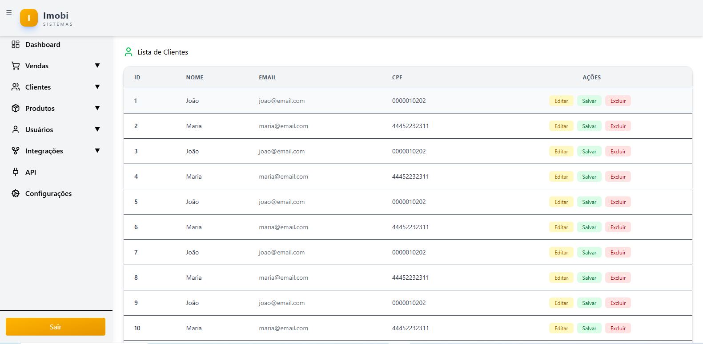
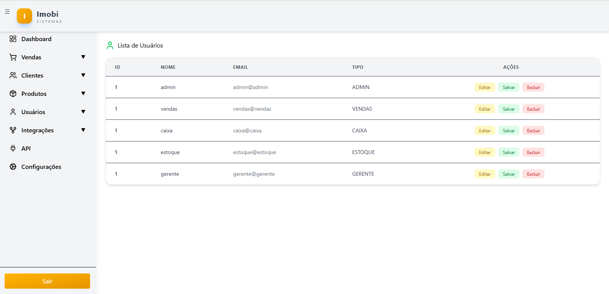
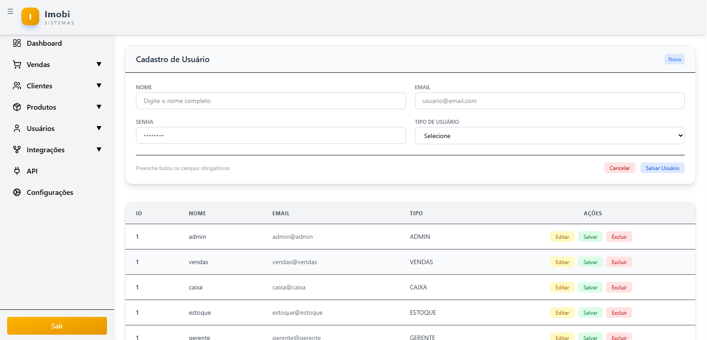
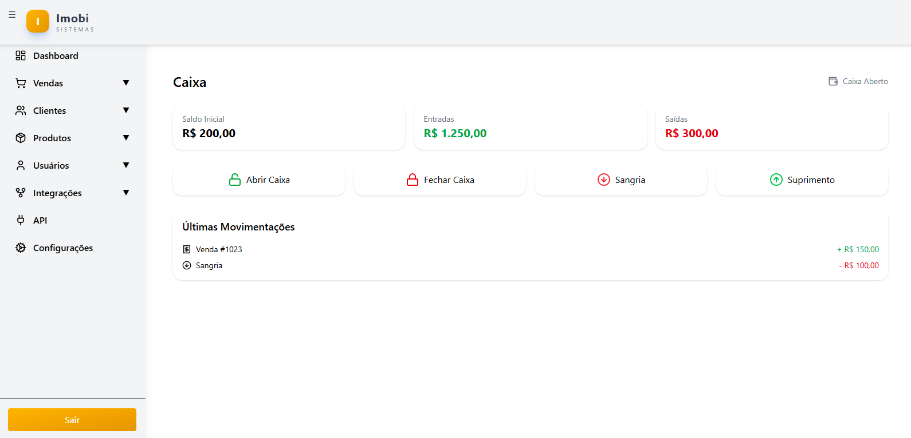

## Projeto desenvolvido como parte do curso DESENVOLVIMENTO JAVASCRIPT DO SENAI

## Tela de Login

## Listagem de Produtos

## Utilizando Api publica  do Fakestore
## https://fakestoreapi.com/products

## Listagem Clientes

## Listagem Usuarios

## Cadastro Usuarios

## Caixa

